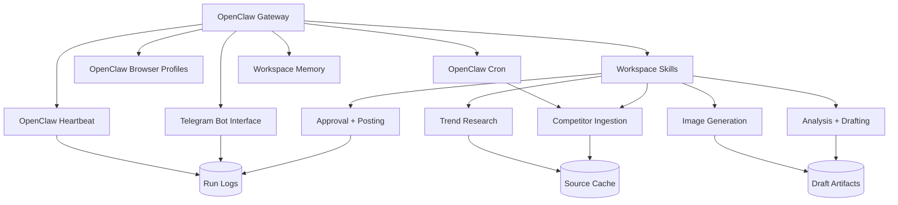
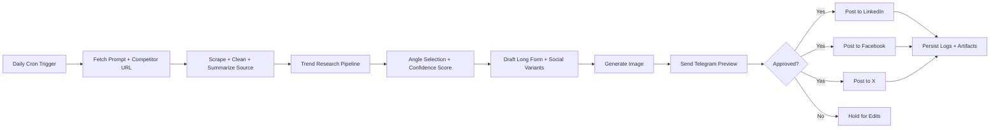

# OpenClaw Content Sentinel
## Week 1 Research and Architecture Report

Author: Codex  
Date: March 25, 2026  
Scope: Week 1 deliverable for the autonomous daily content generation and posting agent described in the internship assignment.

## 1. Executive Summary

OpenClaw Content Sentinel is feasible as a self-hosted, OpenClaw-first system if the design stays disciplined about three things:

1. OpenClaw remains the orchestration layer, scheduler, browser controller, Telegram interface, and operator control plane.
2. All research and automation paths use free/open methods only: RSS, public search, public news pages, self-hosted metasearch, manual browser sessions, and local storage.
3. The system treats social posting automation as operationally fragile and legally sensitive, with mandatory human approval and safe fallback modes.

The recommended MVP architecture is:

- OpenClaw Gateway as the central runtime.
- Native OpenClaw cron for the daily run.
- Native OpenClaw heartbeat for health checks, auth/session drift detection, and approval reminders.
- Native Telegram channel integration as the operator console.
- Custom workspace skills for competitor ingestion, trend research, analysis, drafting, image generation, approval, and posting.
- Native OpenClaw browser control with a dedicated automation profile per platform.
- Local filesystem plus optional local vector storage for history and retrieval.

The main architectural conclusion is straightforward:

- Pure OpenClaw is enough for the MVP.
- LangGraph plus a vector store becomes valuable only after the baseline workflow is stable.
- Full autonomous posting to LinkedIn, Facebook, and X through browser automation is technically possible, but as of March 25, 2026 it carries explicit Terms-of-Service and account-risk concerns. The production design must therefore include operator approval, retries, circuit breakers, and a draft-only fallback.

## 2. What OpenClaw Gives Us Natively

Based on the current OpenClaw documentation reviewed on March 25, 2026, the framework already provides the core primitives this project needs.

### 2.1 Gateway-Centered Runtime

OpenClaw is a self-hosted gateway and agent runtime, not just a prompt wrapper. The Gateway owns:

- channel integrations such as Telegram,
- job scheduling,
- browser control,
- agent sessions,
- tool routing,
- workspace loading,
- security controls,
- logs and diagnostics.

This matters because the assignment explicitly requires OpenClaw-first architecture and forbids bolting the whole system onto outside schedulers or paid middleware.

### 2.2 Skill System

OpenClaw skills are `SKILL.md`-based directories compatible with AgentSkills. The current precedence model is:

1. bundled skills,
2. `~/.openclaw/skills`,
3. `<workspace>/skills` with highest priority.

Skills can be gated by:

- operating system,
- required binaries,
- required env vars,
- required config flags.

This is the right extension point for every custom function in this project:

- competitor ingestion,
- trend research,
- content generation,
- image generation,
- posting,
- moderation/approval,
- recovery and diagnostics.

### 2.3 Browser Control

OpenClaw's browser tool is already aligned with the assignment. The official docs state that OpenClaw can run a dedicated Chrome, Brave, Edge, or Chromium profile, isolated from the user's personal browser, controlled through a loopback service in the Gateway. Internally, advanced actions use Playwright on top of CDP. The browser layer supports:

- dedicated named profiles,
- snapshots and screenshots,
- click, type, and select actions,
- remote CDP if needed,
- Chrome extension relay,
- Playwright-backed interactions,
- SSRF controls,
- profile isolation.

This is sufficient for both:

- competitor page inspection and extraction,
- browser-based posting flows.

### 2.4 Scheduling: Cron and Heartbeat

OpenClaw has two separate automation mechanisms and they should both be used:

- `cron`: exact daily scheduling, persisted under `~/.openclaw/cron/`, with retries and run logs.
- `heartbeat`: periodic awareness in the main session, designed for low-noise monitoring and batch checks.

Recommended use in this project:

- daily content generation run: `cron`
- approval reminders, failed-post checks, stale draft alerts, expired session detection: `heartbeat`

This separation is important because content generation needs exact timing, while operational awareness benefits from cheaper, batched periodic checks.

### 2.5 Native Telegram Integration

OpenClaw's Telegram integration is already production-oriented:

- grammY-based Bot API integration,
- long polling by default, optional webhooks,
- pairing and allowlist controls,
- command menu registration,
- inline buttons with callback data,
- send, edit, delete, and react actions,
- group and topic routing.

This is enough to implement the required Telegram command surface:

- `/status`
- `/run-now`
- `/approve`
- `/reject`
- `/draft`
- `/logs`
- `/pause`
- `/resume`
- `/sessions`

Important nuance: custom Telegram commands are menu entries only. Their behavior still has to be implemented through skills, slash commands, or command-handling logic.

### 2.6 Memory Model

OpenClaw memory is intentionally simple:

- daily memory files in `memory/YYYY-MM-DD.md`,
- optional curated `MEMORY.md`,
- semantic lookup via `memory_search`,
- targeted reads via `memory_get`.

The source of truth is plain Markdown in the workspace, which is good for auditability and portability. For this project, that native memory is enough for:

- operator notes,
- posting history summaries,
- known competitor patterns,
- platform incident notes,
- brand voice instructions.

It is not enough by itself for scalable retrieval over large competitor archives. That is where an optional local vector store becomes useful later.

## 3. Recommended Week 1 Architecture

### 3.1 Proposed Runtime Topology

### 3.2 Core Agent Flow

### 3.3 Recommended Deployment Choice

For Week 1, the best deployment target is a self-hosted Ubuntu server or dedicated VM with persistent storage. This is better than a laptop-first deployment because:

- cron reliability is higher,
- Telegram remains reachable continuously,
- browser profiles and logs persist cleanly,
- 14-day and 30-day run validation are easier,
- Docker sandboxing is cleaner.

Windows is still workable for local prototyping, but I would not make it the primary production host.

### 3.4 Diagram and Visual Analysis

The current Week 1 report contains two core visuals: the runtime topology diagram and the daily execution flow diagram. Even though the project folder does not currently include separate image files, these diagrams function as the visual backbone of the architecture report and should be treated as report figures in the final Word document.

#### Visual 1: Runtime Topology

What the diagram shows:

- OpenClaw Gateway as the control center,
- Telegram, cron, heartbeat, browser profiles, skills, and memory attached to the gateway,
- business capabilities such as ingestion, research, drafting, image generation, approval, and posting layered under the skill system,
- persistent artifacts such as cache, drafts, and logs flowing out of the execution path.

Why it matters:

- it proves the design is OpenClaw-first rather than an external orchestration stack,
- it makes infrastructure responsibilities clear,
- it separates system primitives from business logic,
- it highlights that observability and storage are first-class concerns, not afterthoughts.

What the visual reveals architecturally:

- the gateway is a single critical dependency and therefore must be monitored,
- browser profiles are operational assets and not disposable tooling,
- logs and artifacts must be persistent if the team wants to prove reliability and zero-cost operation,
- the skill layer is the main extensibility surface and should remain modular.

#### Visual 2: Daily Execution Flow

What the diagram shows:

- a deterministic sequence from cron trigger to source ingestion, trend research, angle selection, drafting, image generation, Telegram approval, and final posting,
- a human-in-the-loop branch where rejection or non-approval stops publication,
- a final persistence step for logs and artifacts after successful posting.

Why it matters:

- it translates the business requirement into a controlled state flow,
- it makes the approval gate explicit,
- it shows that posting is downstream from research and drafting rather than a loosely coupled side action,
- it creates a natural foundation for later LangGraph checkpointing if the workflow becomes more complex.

What the visual reveals operationally:

- approval is the highest-leverage control point for reducing public risk,
- confidence scoring belongs before Telegram preview, not after,
- each downstream posting branch can fail independently and should log separately,
- the flow is suitable for resumable execution because each stage has a clear boundary.

#### Visual Conclusion

Taken together, these visuals support the core recommendation of the report:

- use OpenClaw as the orchestration and control plane,
- preserve human approval before publication,
- design the workflow as a sequence of explicit, inspectable stages,
- treat observability, browser stability, and artifact retention as part of the product, not just engineering support work.

## 4. Zero-Cost Integration Strategy

The assignment's hard constraint is zero cost beyond the LLM. That removes most commercial APIs from consideration and forces the design toward public web access, self-hosted components, and local storage.

### 4.1 Competitor Ingestion

Recommended approach:

- user supplies the competitor URL,
- OpenClaw browser opens the page,
- extractor skill reads the rendered page and captures:
  - title,
  - publish date if available,
  - author if available,
  - main claims,
  - headings,
  - citations and links,
  - structured notes on tone, angle, and audience.

Implementation notes:

- Prefer rendered DOM extraction over naive raw HTML parsing for modern JS-heavy sites.
- Strip navigation, comments, cookie banners, and sidebars.
- Preserve attribution metadata and the source URL.
- Never reuse large verbatim blocks in the generated output.

Week 1 scope:

- public page extraction only,
- no auth walls,
- no CAPTCHA-solving,
- no bypass behavior,
- explicit prompt-injection sanitization before handing text to the model.

### 4.2 Trend Research

Recommended zero-cost pipeline, in order of trust:

1. RSS and public news feeds relevant to the industry
2. self-hosted SearXNG queries for broad web discovery
3. public Google News and site-specific searches
4. Google Trends scraping as an optional weak signal, not a primary truth source

Important finding: the widely used `pytrends` repository is archived. It can still be used experimentally, but it is no longer a strong production dependency. Therefore:

- use RSS and search as the baseline,
- use trends scraping only as a supplemental signal,
- wrap trend collection in retries and low confidence weighting.

Why this matters:

- RSS is stable and cheap.
- SearXNG is self-hosted and free.
- search result diversity reduces tunnel vision from one source.
- trend scraping is brittle, so it should not decide the article angle by itself.

### 4.3 Content Analysis and Generation

The generation pipeline should be deterministic in structure even if model-backed in execution.

Recommended stages:

1. Source extraction
2. Trend aggregation
3. Claim map and gap analysis
4. Topic angle selection
5. Long-form draft
6. Platform-specific rewrites
7. Final quality gate

Expected outputs per run:

- one canonical article or long-form post,
- one LinkedIn version,
- one Facebook version,
- one X version,
- one image prompt and resulting asset,
- one operator summary sent to Telegram.

The system should also persist:

- source URL,
- supporting links,
- trend evidence,
- confidence score,
- approval decision,
- posting result by platform.

### 4.3.1 Confidence Gating

The agent should not treat every successful draft as publish-ready. A simple first-pass confidence model is enough for Week 1:

- `0.80-1.00`: draft is complete enough to send for approval
- `0.50-0.79`: send for approval with an explicit low-confidence warning
- `<0.50`: do not draft for posting; send a Telegram exception summary instead

Suggested score inputs:

- extraction completeness,
- number of corroborating trend signals,
- source freshness,
- novelty against recent posts,
- policy-risk flags,
- platform-postability checks.

### 4.4 Image Generation

Strict zero-cost interpretation means image generation should not rely on paid provider image APIs. The safest architecture is:

- local image model runner, exposed through a local API,
- wrapped as an OpenClaw skill.

Recommended options:

- ComfyUI with a local open model,
- SDXL Turbo or FLUX.1-schnell class model depending on hardware,
- branded template fallback when local generation is unavailable.

If hardware is limited, Week 1 should plan for a fallback:

- Telegram approval still works,
- image can be optional,
- or a deterministic branded text-card renderer can be used until local image generation is provisioned.

### 4.5 Posting Strategy

The only zero-cost write path to LinkedIn, Facebook, and X is browser automation with persistent logged-in sessions.

Recommended operating model:

- one dedicated OpenClaw browser profile per platform,
- manual login by operator,
- persistent session reuse,
- posting only after Telegram approval,
- pre-submit screenshot,
- post-submit confirmation screenshot,
- structured success and failure log.

OpenClaw's own browser-login guidance emphasizes manual login flows for protected sites like X and warns about anti-bot friction. That matches production reality across all three platforms.

### 4.5.1 Browser Hardening and Anti-Detection Practice

The goal is not to "look random." The goal is to behave like a stable, low-volume operator workflow. Recommended practice:

- use one persistent browser profile per platform,
- perform first login manually and reuse the session,
- keep concurrency at one active posting tab per platform,
- wait on deterministic page-state checks, not arbitrary sleeps alone,
- capture screenshots before and after submit,
- detect challenge, login, or suspicious-activity pages and abort immediately,
- cool down after failures instead of retry-spamming the platform,
- keep posting frequency low and predictable.

These patterns are what should be adapted from community Playwright and MCP references. The platform-specific submit logic itself should still be rebuilt and owned locally.

## 5. Community Skill References: What To Adapt vs Rebuild

The assignment names community references such as `linkedin-automation`, `meta-fb-inbox`, `ai-hunter-pro`, and `playwright-scraper`. The right approach is not to import them wholesale.

### 5.1 Adapt

Use community skills only as design references for:

- selector retry patterns,
- browser wait strategies,
- persistent profile handling,
- screenshot-before-submit discipline,
- JSON-shaped result payloads,
- task decomposition patterns,
- operator approval UX.

### 5.2 Rebuild

Rebuild from scratch for this project:

- competitor scraping logic,
- all publishing flows,
- credential and session handling,
- prompt-injection defenses,
- brand voice enforcement,
- confidence gating,
- audit logging,
- Telegram approval and override commands.

Reason:

- this project has stricter security and auditability requirements than generic community automation,
- social posting selectors drift often,
- operator trust depends on clean, minimal code paths,
- third-party skills are not an acceptable security boundary.

## 6. Pure OpenClaw vs OpenClaw + LangGraph + Local Retrieval

### 6.1 Pure OpenClaw

Advantages:

- fewer moving parts,
- simpler deployment,
- native cron, heartbeat, browser, Telegram, and workspace memory,
- easier debugging in Week 1,
- lower operational burden.

Limitations:

- less explicit state-machine control,
- weaker resumability for long multi-step workflows,
- harder to checkpoint a complex approval and revision pipeline,
- retrieval over a growing archive becomes ad hoc.

### 6.2 OpenClaw + LangGraph

LangGraph's official strengths are durable execution, human-in-the-loop, checkpointing, and stateful orchestration. That is attractive here because the workflow naturally contains pauses, approvals, and retries.

Best fit for LangGraph in this project:

- orchestrating `Researcher -> Analyzer -> Writer -> Editor -> Publisher`,
- checkpointing between stages,
- pausing at Telegram approval,
- resuming after failure without replaying everything,
- explicit state inspection for debugging.

Main cost:

- more engineering surface area,
- more code to own,
- more places for state drift if introduced too early.

### 6.3 Vector Store and Graph Store

Optional local vector storage is useful for:

- historical post retrieval,
- competitor article archive recall,
- avoiding repeat angles,
- retrieving prior brand-approved phrasing.

Practical local choices:

- Chroma for easiest local developer experience,
- FAISS for lightweight local similarity search.

Chroma's own docs still support open-source local single-node use, though they note local mode may temporarily lag distributed or cloud parity. FAISS remains the lower-level option when the requirement is simply local similarity search.

Graph storage is lower priority. A Neo4j-style knowledge graph can help with:

- competitor-topic relationships,
- recurring themes,
- entity tracking,
- cross-post topic evolution.

But it is not required for the MVP.

### 6.4 Recommendation

For this project:

- Week 1: pure OpenClaw plus local file storage.
- Week 2: add LangGraph only if the deterministic pipeline is becoming messy.
- Week 2 or 3: add a local vector store for article and post history.
- Graph store: optional stretch objective, not a Week 1 dependency.

## 7. Security and Observability

This project has an unusually large blast radius because it combines model output, browser automation, public posting, and chat control.

### 7.1 Security Principles

1. Treat all external content as hostile.
2. Treat all third-party skills as untrusted.
3. Keep social credentials out of prompts and workspace files.
4. Gate every public-write action behind approval or explicit policy.
5. Prefer isolated execution except where host browser access is operationally required.

### 7.2 Sandboxing

OpenClaw supports Docker-based tool sandboxing with per-session or per-agent scope. Recommended policy:

- use sandboxing for scraping, research, and text processing,
- keep browser posting on the host-controlled OpenClaw browser profile when needed,
- keep workspace access minimal,
- avoid `workspaceAccess: "rw"` unless a skill genuinely needs it.

This matches OpenClaw's own security guidance and the threat model's emphasis on prompt injection, tool misuse, and exfiltration.

### 7.3 Telegram Access Control

Recommended Telegram control model:

- `dmPolicy: "pairing"` or strict allowlist,
- group access disabled unless explicitly needed,
- only approved operator IDs allowed,
- approval buttons limited to approvers,
- command audit trail stored in logs.

### 7.4 Prompt-Injection Defense

Competitor pages and public search results must be treated as untrusted instructions. The pipeline should:

- separate extraction from generation,
- strip or neutralize imperative instructions from page text,
- pass source text as data, not authority,
- block tool-use decisions from being influenced by scraped content,
- require approval before social posting.

### 7.5 Credential and Session Handling

Store secrets only in OpenClaw config or OS environment, never in workspace memory files.

Keep:

- Telegram bot token in config or env,
- LLM credentials in config or env,
- browser sessions inside dedicated OpenClaw-managed profiles,
- run artifacts in the workspace,
- raw secrets outside the git-tracked workspace.

### 7.6 Observability

Required logs and artifacts per run:

- run ID,
- trigger source,
- prompt and competitor URL hash,
- extraction status,
- trend source list,
- selected angle,
- model used,
- confidence score,
- approval status,
- posting result per platform,
- screenshot paths,
- failure reason and retry count.

Native OpenClaw cron already keeps run history and retry behavior. The project should add a higher-level application log on top for business visibility.

To support the "zero additional cost" requirement, the run log should also record:

- LLM provider and model used,
- whether any non-LLM paid API was invoked,
- the exact free-source inputs used for research,
- whether image generation was local or skipped.

## 8. Legal and Ethical Position

This section cannot be hand-waved. The current project brief asks for exactly the kind of browser automation that major platforms usually restrict.

### 8.1 Competitor Content

Recommended policy:

- ingest only public URLs supplied by the operator,
- use extracted content only for analysis and synthesis,
- keep citations and source links,
- avoid reproducing large verbatim passages,
- disclose when a post is a response or commentary if appropriate.

### 8.2 Platform Terms Risk

As reviewed on March 25, 2026:

- LinkedIn policy language prohibits bots or unauthorized automated methods.
- Meta and Facebook terms prohibit accessing or collecting from products using automated means without permission in many contexts.
- OpenClaw's own browser-login guidance for X recommends manual login and warns that protected sites often trigger anti-bot defenses and account locks.

Therefore the honest architecture position is:

- technically feasible,
- operationally fragile,
- legally and policy sensitive,
- not safe to present as "fully compliant by default."

### 8.3 Practical Mitigation

If the business still chooses to proceed:

- require human approval before every publish,
- minimize action scope to one post per platform per run,
- use first-party accounts intended for this automation,
- throttle aggressively,
- maintain a draft-only fallback,
- prepare for account challenge or session invalidation,
- document that this is browser automation, not an official API integration.

## 9. Week 1 Implementation Plan

Week 1 should deliver the following concrete outcomes.

### 9.1 Target Deliverables

- OpenClaw instance deployed on the selected host
- Telegram bot connected and locked down
- workspace initialized and git-backed
- `HEARTBEAT.md` and operator command surface defined
- custom skills scaffolded:
  - `competitor-ingest`
  - `trend-research`
  - `content-pipeline`
  - `approval-control`
- basic browser profile setup completed
- one end-to-end dry run that reaches Telegram draft preview

### 9.2 Day-by-Day Plan

Day 1:

- install OpenClaw,
- configure workspace,
- configure LLM,
- enable Telegram,
- verify cron and heartbeat are functional.

Day 2:

- deliver this architecture report,
- set up Telegram commands and approval path,
- implement competitor fetch prototype,
- implement trend-source adapters for RSS and search.

Day 3:

- build first structured analysis prompt,
- produce long-form and social draft outputs,
- persist artifacts and logs.

Day 4:

- add confidence scoring,
- add error taxonomy,
- add Telegram `/status`, `/run-now`, `/logs`.

Day 5:

- run a supervised dry run,
- fix workflow gaps,
- lock the Week 2 implementation backlog.

### 9.3 Day 2 Sync Agenda

The required Day 2 sync should review:

1. policy-risk acceptance for browser posting,
2. host choice for deployment,
3. LLM provider and budget guardrails,
4. image-generation path,
5. approval policy: every post vs threshold-based autonomy,
6. whether LangGraph enters in Week 2 or waits.

## 10. Final Recommendation

The correct Week 1 strategy is:

- build the MVP as pure OpenClaw,
- use native cron, heartbeat, browser, Telegram, workspace memory, and skills,
- keep the trend pipeline free and redundant,
- keep posting human-approved,
- defer LangGraph and vector memory until the core loop is stable,
- treat compliance and account-risk as real design inputs, not footnotes.

This gives the fastest route to a reliable zero-cost prototype without building unnecessary infrastructure too early.

## Appendix A: Proposed Skill Inventory

| Skill | Purpose | Week |
|---|---|---|
| `competitor-ingest` | Open URL, extract cleaned article data, capture metadata | 1 |
| `trend-research` | Pull RSS, search, and trend signals and rank themes | 1 |
| `content-pipeline` | Build analysis, outline, article, and platform variants | 1 |
| `approval-control` | Telegram preview, approve, reject, and edit loop | 1 |
| `image-local` | Generate branded image from approved concept | 2 |
| `publisher-linkedin` | Open profile, create post, verify success | 2 |
| `publisher-facebook` | Open profile or page, create post, verify success | 2 |
| `publisher-x` | Open profile, compose post, verify success | 2 |
| `run-recovery` | Retry, circuit-breaker, session, and selector diagnostics | 3 |

## Appendix B: Source Notes

Primary sources reviewed on March 25, 2026:

- OpenClaw docs home: https://docs.openclaw.ai/
- OpenClaw skills: https://docs.openclaw.ai/tools/skills
- OpenClaw ClawHub: https://docs.openclaw.ai/tools/clawhub
- OpenClaw agent workspace: https://docs.openclaw.ai/concepts/agent-workspace
- OpenClaw cron jobs: https://docs.openclaw.ai/automation/cron-jobs
- OpenClaw Telegram: https://docs.openclaw.ai/channels/telegram
- OpenClaw browser tool: https://docs.openclaw.ai/tools/browser
- LangGraph overview: https://docs.langchain.com/oss/python/langgraph
- LangGraph durable execution: https://docs.langchain.com/oss/python/langgraph/durable-execution
- Chroma open-source overview: https://docs.trychroma.com/docs/overview/oss
- Faiss docs: https://faiss.ai/
- SearXNG overview: https://docs.searxng.org/
- SearXNG search API: https://docs.searxng.org/dev/search_api
- pytrends repository status: https://github.com/GeneralMills/pytrends

Policy references reviewed through official and public documentation surfaced on March 25, 2026:

- LinkedIn legal and policy pages
- Meta and Facebook legal terms pages
- X help and policy pages
- OpenClaw browser-login guidance and related security documentation

Additional OpenClaw documentation in the memory, heartbeat, browser-login, and security sections was reviewed through the official docs site navigation.

Where exact policy wording was unstable or surfaced through search snippets rather than a clean official excerpt, this report intentionally uses conservative paraphrase instead of overclaiming precision.
